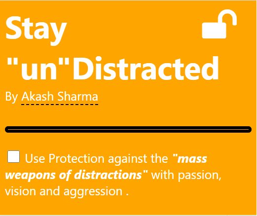
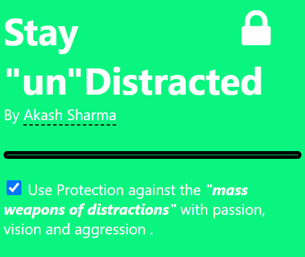

# Stay-unDistracted-Chrome-Extension
Now Stay Protected from Distractions with "passion, vision and aggression" via this Chrome Extension

### A new-tab page extension which overrides your new tab with videos full of passion🤍, vision 🚀 and aggression 🐾 

## How to install this extension:
- Download/Clone the repo
- Decompress the folder 
- Open chrome://extensions/
- Switch on the "Developer Mode" toggle on the top right corner. 
- Click on "Load Unpacked"
- Select this chrome extension folder
- Now view your set of extensions and pin this extension to use in handy !

## How does this extension works?
- After installing the extension, your new-tab page should be like the default chrome based new-tab page.
- **Note**: If you see an alert prompt from chrome regarding override of the new tab - Click "*Keep It*" (Requires one-time permission only :)
- So now, you gotta click on the extension and observe the popup menu.
- If its orange like this -> your probably in distraction zone and you would have to enable the protection by clicking the checkbox.
  
  

- Now after reopening the extension popup, you must have a green window with a padded lock indicating that the extension is in action :)
  
  

- Now, will reading or studying if you wanna open new tab (and distracted), you will be thwarted by an interesting video 😂

## Additional/Optional instructions
- You can change the videoshown in the new tab as well! (mp4 video file)
   - First step is to upload it to this chrome extension folder 
   - Then go to `redirect.html` and check for a video tag <video> and change its `src="<filename>.mp4"` 
   - Reload the extension and try it out!!
 
 ## Future Updates 
 - Enabling users to upload their own videos for new-tab page
 - **Conditional overriding** On disabled state,  the new-tab page should point to the default user-defined new-tab extension page instead or hard overriding to default chrome page.

## Ending Notes
- If you have any issues/feature requests, kindly create them on this repo.
- If you have any comments, suggestions or ideas, feel free to message me 😊 (Contact info is on my Github Profile)  
